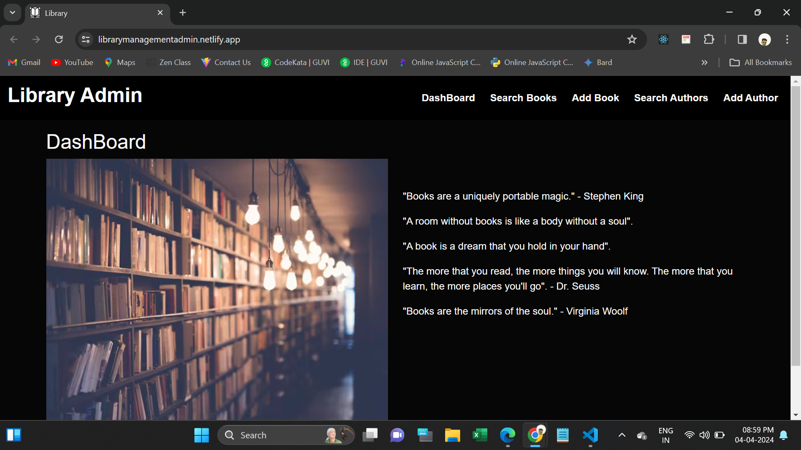
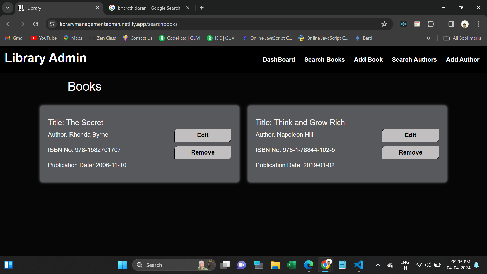
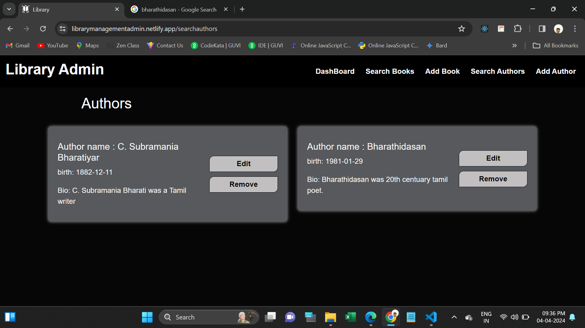
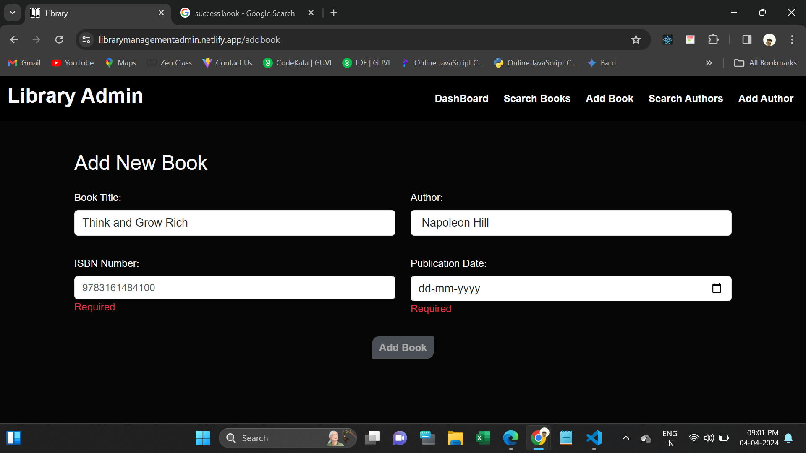
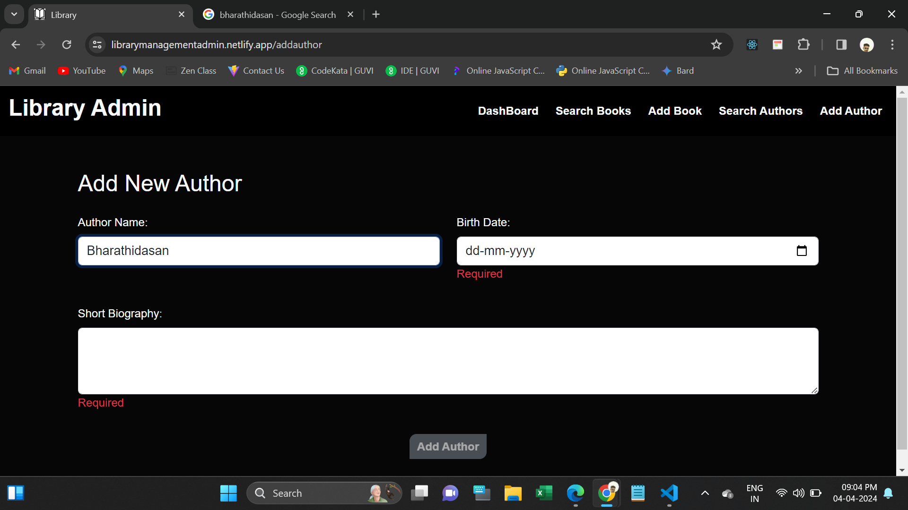
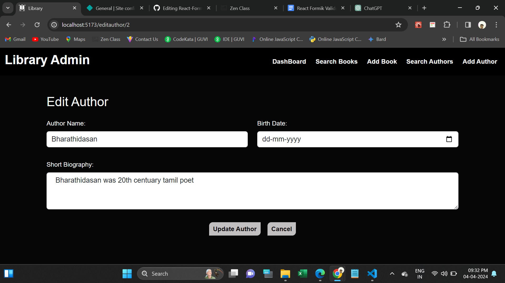

# React Formik Validation

Develop an admin dashboard for a library management system.

Implement functionalities to manage book and author details.

Utilize Formik for form validations throughout the application.

Enable users to add, edit, and delete book records with fields like title, author, ISBN number, and publication date.

Allow users to add, edit, and delete author records including name, birth date, and biography.

Ensure all forms in the dashboard adhere to validation standards set by Formik.

Create a clean and responsive design for the dashboard to enhance user experience.

Prioritize ease of use and navigation for efficient interaction with the dashboard.

 
  <h4>Mock API URL </h4>
  Books: https://660c281e3a0766e85dbd8fa0.mockapi.io/library   
  Authors: https://660da3ee6ddfa2943b34e888.mockapi.io/libraryauthor
   
  <h4>Used Tools.</h4>
<ul>
  <li>Html</li>
  <li>CSS</li>
  <li>Bootstrap</li>
  <li>Javascript</li>
  <li>React JS</li>
</ul>
 
<h4>Npm Packages are used:</h4>
<ul>
  <li>https://www.npmjs.com/package/bootstrap</li>
  <li>https://www.npmjs.com/package/react-router-dom</li>
  <li>https://www.npmjs.com/package/axios</li>
 <li>https://www.npmjs.com/package/formik</li>
</ul>
 
<h3>Deployed URL</h3>
https://librarymanagementadmin.netlify.app/
 

<h5>Screenshots</h5>
1. Dashboard Page

2. Books Page

3. Authors page

4. Add Book Page

5. Add Author Page

6. Edit Book page

7. Edit Authors page

